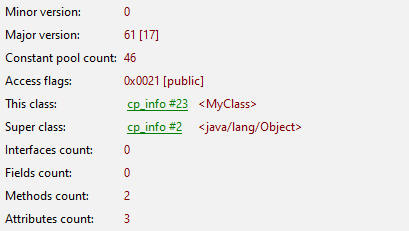

# SB - Leitor e Exibidor

### Matrículas/Alunos:

- 170105067 Hyago Gabriel Oliveira Figueiredo
- 170121348 João Pedro Queiroz Rodrigues
- 180076272 Jonas de Souza Fagundes
- Samuel

### Clonar repo:

```
git clone https://github.com/JonasdeSouza/Leitor-Exibidor.git
```

## COMO RODAR:

#### Nome do arquivo .class:

- MyClass.class

Caso queira mudar o arquivo .java, será necessário compilar novamente, assim rode o seguinte comando no folder [Assets](./assets/) :

```
javac -cp . MyClass.java
```

#### Utilizar os próximos comandos no root da pasta do trabalho

- Para compilar o programa
  ```
  make compile
  ```
- Para compilar e rodar o trabalho de uma vez só
  ```
  make exec
  ```
- Para compilar, rodar o trabalho e escrever o resultado em saida.txt

  ```
  make arquivo
  ```

- Para limpas objetos e saídas anteriores

  ```
  make clean
  ```

  **IMPORTANTE QUE NÃO HAJA MUDANÇA NOS DIRETÓRIOS PARA UM BOM FUNCIONAMENTO DO PROGRAMA**

#### Padrão para Saída jclasslib:

- 

## Saída do Programa:

Assim como no jclasslib, a saída, via terminal, consiste em:

- Minor Version;
- Major Version;
- Constant pool count;
- Access flags;
- This class;
- Super class;
- Interfaces Count:
- Fields Count;
- Methods count;
- Attributes count;

### Header das funções em linguagem C

- Descrição de funcionalidade e dos parâmetros, de entrada e saída, de cada função dentro dos próprios arquivos .c

```C
 // Função para ler um valor de 16 bits em formato big-endian
uint16_t readUInt16(FILE *file);
```

```C
// Função para ler um valor de 32 bits em formato big-endian
uint32_t readUInt32(FILE *file)
```

```C
// Função para imprimir o valor da constante de acordo com o tipo de tag
void printConstantValue(FILE *file, uint8_t tag);
```

```C
// Retorno o mnemonico para o bytecode enviado como parâmetro
char *getMnemonic(uint8_t bytecode);
```

## Indicações da plataforma utilizada:

- Compilador: GCC
- Sistema Operacional: Pop!\_OS 22.04 & Win11
- Ambiente utilizado para programar: Visual Studio Code
